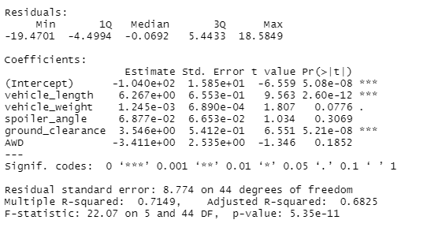
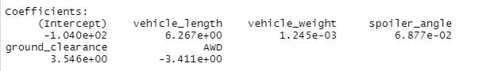
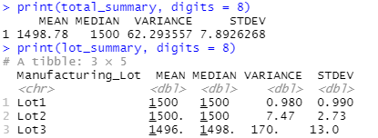
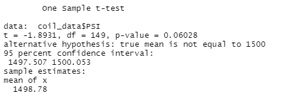
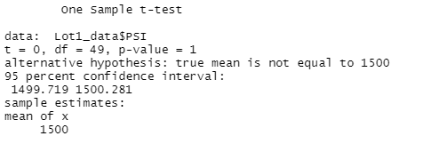
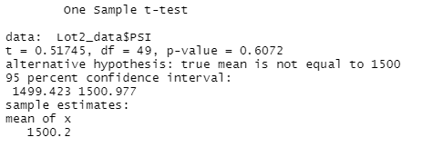
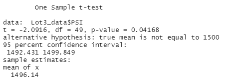

# R_Statistics MECHA CAR ANALYSIS

## Deliverable 1)

### Linear Refression to Predict MPG

A regression analysis was performed on the vehicle data of multiple models. Multiple variables were assessed, to include:

* MPG
* Vehicle Length
* Vehicle Weight
* Spoiler Angle
* Ground Clearance
* AWD

The analysis revealed that overall, there was a trend between the miles per gallon each vehicle model tested, and the five other variables. Individually, only two variables indicated a non-random correlation:

* Vehicle Length
* Ground Clearance

This was determined when assessing the "P-Value" at a 95% confidence interval. Both of these variables saw P-Values within the confidence threshold (P < .05). 

Overall, the linear regression had a P-Value within the confidence threshold of 95% (P<.05), and a multiple R-Squared of .7149. This indicates that the null hypothesis can be rejected, and that the slope of the regression line is non-zero. 

This model can effectively predict the MPG of the MechaCar, as the overall linear regression indicated that a moderate amount of the variance in the data was explained by the model, and the model was within the 95% confidence threshold. This all indicates that there is a relationship between the variables and the MPG predicted by the resultant model.

## Deliverable 2)

### Summary Statistics On Suspension Coils

Two analyses were conducted, one on the total population of samples and a breakdown specifically looking at each individual lot (Lots 1-3). The "Total Summary" statistics provided a summary of the PSI across all manufacturing lots. The "Total Summary" revealed the following statistics:

* Mean: 1498.78
* Median: 1500
* Variance: 62.29356
* Standard Deviation: 7.892627

The second analysis looked into each manufacturing lot to determine if individual lots saw different testing results. The "Lot Summary" revealed the following statistics:

Lot 1:

* Mean: 1500
* Median: 1500
* Variance: .980
* Standard Deviation: .990

Lot 2:

* Mean: 1500
* Median: 1500
* Variance: 7.47
* Standard Deviation: 2.73

Lot 3:

* Mean: 1496
* Median: 1498
* Variance: 170
* Standard Deviation: 13.0

This breakdown revealed that the lots saw progressively decreasing quality from "Lot 1" to "Lot 3". Given a design criteria having a variance limit of 100 PSI, "Lot 3" failed this threshold with a variance of 170 PSI. This indicates that the spread of the "Lot 3" data from the mean is significantly larger than the other manufactuing lots. The individual breakdown of the lots was crucial, as the overall statistics saw a variance of 62.29356 which was within the threshold criteria. This would have allowed manufactuing to continue despite an entire lot failing the design criteria.

## Deliverable 3)

### T-Tests on Suspension Coils

Four T-Tests were conducted to analyze all manufactured vehicles and each individual manufacturing lot (Lots 1-3). 

Overall: 

Indicated that the overall true mean of the suspension coil PSI was 1500 given 149 degrees of freedom and a 95% confidence interval.

Lot 1:

Indicated that the overall true mean of the suspension coil PSI was 1500 given 49 degrees of freedom and a 95% confidence interval, based only on Lot 1 data.

Lot 2:

Indicated that the overall true mean of the suspension coil PSI was 1500 given 49 degrees of freedom and a 95% confidence interval, based only on Lot 2 data.

Lot 3:

Indicated that the overall true mean of the suspension coil PSI was not 1500 given 49 degrees of freedom and a 95% confidence interval, based only on Lot 3 data.

The T-Tests revealed that overall, when tested against a mean of 1500 PSI, the true mean of the data was 1500 PSI given a 95% confidence interavl. When looking at the individual lots, "Lot 1" and "Lot 2" saw predicted true means of 1500 PSI given 95% confidence intervals. "Lot 3" saw a P-Value (P>.05), which rejected the hypothesis that the true mean was 1500 PSI based only on "Lot 3" data. This indicated that "Lot 3" again was not within the design criteria threshold, and that "Lot 3" should be re-evaluated prior to releasing those components.

## Deliverable 4)

### Study Design: MechaCar vs Competition

A study comparing the MechaCar to competitors' vehicles would be necessary to prove that it truly outperforms and is of value to the consumer. Some such metrics to compare include:

* Overall MPG
* Horsepower
* Acceleration
* Range

Sample hypothesis options for one of these metrics would include:

Overall MPG:
* H0: The average Overall MPG of the MechaCar is greater than the competing vehicles of similar weight.
* HA: The average Overall MPG of the MechaCar is less than the competing vehicles of similar weight.

To test these hypotheses, the following statistical tests could be used:

Overall MPG:

* The Overall MPG could be conducted using an independent T-Test comparing the cumulative data of the MechaCar and the competitors to see if the mean of the datasets are statistically similar or different, and by how much. This would be performed for each competitor against the MechaCar, revealing if the true difference between the vehicles is (is not) 0, and what the mean of each group is.

Data required for this would include:

* MPG data from MechaCar testing given city and highway testing of varying ranges over a the first year of driving.
* MPG data from competing vehicles testing given city and highway testing of varying ranges over a the first year of driving.

